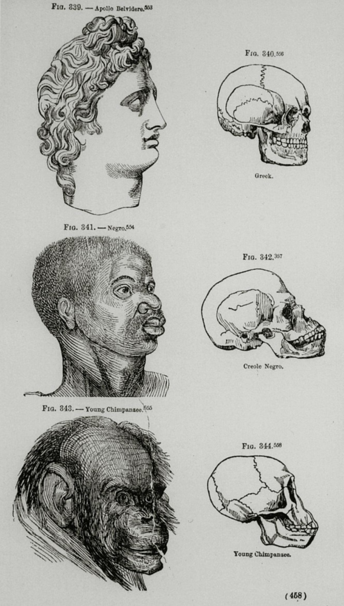
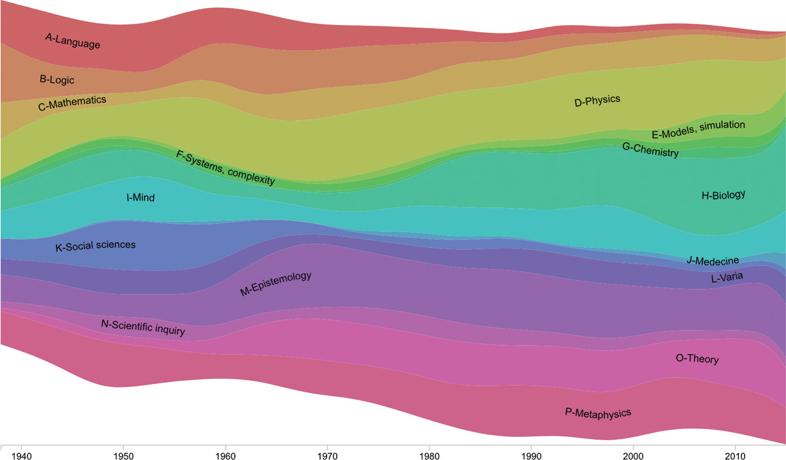

# A brief history of race science

## Some definitions

scientific racism
 ~ efforts to rationalize racial injustice and colonialism by appealing to the epistemic authority of science
 
race science
 ~ scientific research that is amenable to scientific racism

- Can accurately or inaccurately represent scientific findings
- Can be pseudoscience, fringe science, or mainstream
- Can be intentional or unintentional
- Often overlaps with scientific sexism and eugenics

## *[title]*

:::: columns
::: column
17th-18th century: racial taxonomy
Linnaeus, Blumenbach, Cuvier, Kant

19th century: monogenism vs. polygenism, racial anatomy
Agassiz, Morton 

Early 20th century: eugenics
*[]*

:::
::: column

:::
::::

## Marginalization: 1930s

*[anthropology, then biology: Barkan]*

## PF, MQ, and Behavior Genetics

*[Panofsky]*

# Race science as agnotology and echo chamber

# Data and methods

## Pioneer-funded researchers

:::: columns
::: {.column} 
| |
|:-----|
| [Thomas J. Bouchard, Jr.](https://en.wikipedia.org/wiki/Thomas_J._Bouchard_Jr.) |
| Brunetto Chiarelli |
| [Hans Eysenck](https://en.wikipedia.org/wiki/Hans_Eysenck) |
| [Robert Gordon](https://en.wikipedia.org/wiki/Robert_A._Gordon) |
| [Linda Gottfredson](https://en.wikipedia.org/wiki/Linda_Gottfredson) |
| [Garrett Hardin](https://en.wikipedia.org/wiki/Garrett_Hardin) |
| [Joseph M. Horn](https://en.wikipedia.org/wiki/Joseph_M._Horn) |
| [Lloyd Humphreys](https://en.wikipedia.org/wiki/Lloyd_Humphreys) |
| [Arthur Jensen](https://en.wikipedia.org/wiki/Arthur_Jensen) |
| [Michael Levin](https://en.wikipedia.org/wiki/Michael_Levin) |
| [Richard Lynn](https://en.wikipedia.org/wiki/Richard_Lynn) |
| [R. Travis Osborne](https://en.wikipedia.org/wiki/R._Travis_Osborne) |
| [J. Phillippe Rushton](https://en.wikipedia.org/wiki/J._Phillippe_Rushton) |
| [Audrey M. Shuey](https://en.wikipedia.org/wiki/Audrey_M._Shuey) |
| [Philip A. Vernon](https://en.wikipedia.org/wiki/Philip_A._Vernon) |
| [Daniel Vining, Jr.](https://en.wikipedia.org/wiki/Daniel_Vining_Jr.) |
:::

::: column
- @MillerPioneerFundBankrolling1994
- [List of Grantees from PF website](https://web.archive.org/web/20130103005545/http://www.pioneerfund.org/Grantees.html)

\

- WOS author search results for 14 authors (Sept/Oct 2021)
- Identify journals that published more than 5/14
:::
::::

## Corpus

|                                |       |
|:-------------------------------|------:|
| Behavior Genetics              |  2268 |
| Behavioral & Brain Sciences    |   898 |
| Intelligence                   |  1237 |
| **Mankind Quarterly**          |  1821 |
| Person. & Individ. Differences |  7274 |
| Psychological Reports          | 21398 |

- 34k journal articles
- Published 1960-2010
- 3 journals published by American Psychological Association not available
- PID is missing many relevant book reviews and essays
	- eg, [Rushton's review of Lynn's book on Pioneer](https://www.sciencedirect.com/science/article/pii/S0191886901001337) *[confirm not included]*

\
- Extract article full text from PDF or HTML
- Extract noun phrases using spaCy NLP package

## Topic modeling

{width="80%"}

- Statistical method for clustering documents and words simultaneously
- Documents are composed of topics; topics are composed of words
- Custom R package [`tmfast`](https://github.com/dhicks/tmfast)

## Gould's critique of factor analysis

> As a tool for simplification, [PCA/factor analysis] has proved its great value in many disciplines. But many factorists have gone beyond simplification, and tried to define factors as causal entities. This error of reification has plagued the technique since its inception .... [F]actors, by themselves, are neither things nor causes; they are mathematical abstractions. [@GouldMismeasureManRevised1996 284-5]

- `tmfast` uses methods from PCA and factor analysis [@RoheVintageFactorAnalysis2020]
	- (partial) PCA
	- varimax rotation

- Need to avoid hasty reification of topics

## Topic modeling as phenomena construction

Topics as phenomena [@BogenSavingPhenomena1988; @WoodwardDataPhenomenaRestatement2009]

- simplified patterns extracted from word occurrence data
- may or may not be stable:\
  will we see the same topics in a different corpus? [@MalaterreEarlyDaysContemporary2022]
- constructed with minimal role for substantive theory
- **explananda, not explanans**
	
These words tend to be used together; **but why?**\
These test items tend to be answered in the same way; **but why?**

